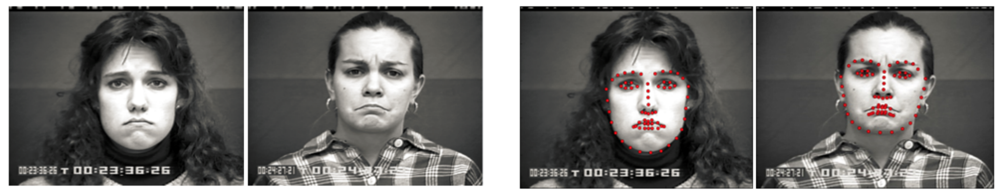

# Facial Expression Recognition

This is the implementation of part of my undergraduate thesis "Feature-Level Joint Learning for Facial Expression Recognition". **Notice**: I am still refactoring the code in Keras2.
<!-- and the [paper](https://ieeexplore.ieee.org/stamp/stamp.jsp?arnumber=8528894) "Facial Expression Recognition with Identity and
Emotion Joint Learning".  -->
<!--  -->


### Prerequisites
* Python 3.6.5 | Anaconda
* Keras 2.1.6

### Pipeline

#### Data
* Download the FER+ dataset in [google drive](https://drive.google.com/file/d/1zzd8uc5bau0gVmK9iQ01dqC_3S0IUYoq/view?usp=sharing) and put it into the data folder.

#### Run
* Run `python main.py --aug=False` to train and evalute our model, with no data augmentation. You can also play with the parameters in `params.py` based on the paper (e.g., batch size).

### Results

### Acknowledgement

<!-- If you find this repository useful, please cite our paper:
```
@article{li2018facial,
title={Facial Expression Recognition with Identity and Emotion Joint Learning},
author={Li, Ming and Xu, Hao and Huang, Xingchang and Song, Zhanmei and Liu, Xiaolin and Li, Xin},
journal={IEEE Transactions on Affective Computing},
year={2018},
publisher={IEEE}
}
``` -->


